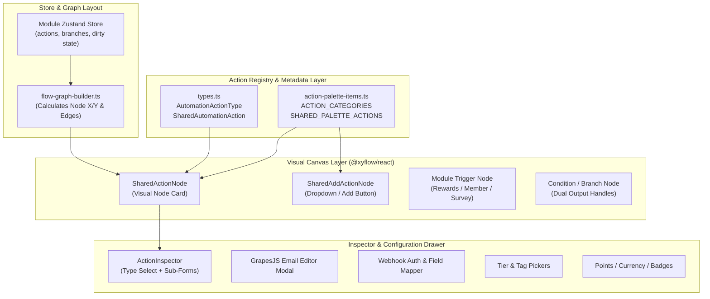
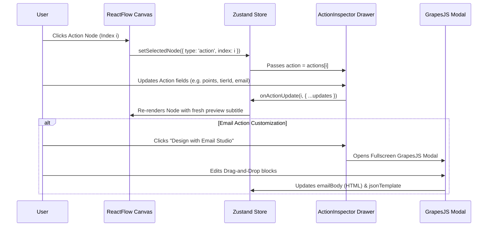

# Automation Flow UI Architecture & Reusable Actions Specification

This document provides the definitive architectural blueprint for the **Automation Flow UI** across Thrico's Entity Dashboard modules, including:
- **Gamification & Rewards Automation** (`/rewards/automation/*`)
- **Member Lifecycle Automation** (`/members/automation/*`)
- **Surveys & Forms Automation** (`/surveys/automation/*`)

It specifies how the visual canvas, node lifecycles, and especially **Reusable Automation Actions** are designed, shared, and extended across the platform.

---

## 1. Executive Summary & Design Philosophy

All automation builders across Thrico share a common mental model:

```
[Trigger Node] ──> [Branch / Condition Node(s)] ──┬──> [YES Path Actions] (Priority/Win)
                                                  └──> [NO Path Actions]  (Consolation/Else)
```

### Core Architectural Tenets
1. **Single Source of Truth for Actions**: Action visual representations, palette cataloging, and inspector configuration forms are centralized in [`components/shared/automation-flow/`](file:///Users/pulseplay/thrico/thrico-entity-dashboard/components/shared/automation-flow).
2. **Channel-Based Categorization**: Every action belongs to one of four standardized enterprise channels:
   - 👥 **Community Channels** (Circle enrollment, space discussions)
   - 🎖️ **Member & Identity Channels** (Tiers, tags, points, virtual currency, coupons, badges)
   - 📬 **Communication Channels** (Email Studio with GrapesJS, Push alerts, WhatsApp)
   - ⚡ **Developer & Integration Channels** (Custom Webhooks, external API relays)
3. **Dual-Path Execution (YES / NO Tracks)**: Flow branches natively split into **YES** (criteria met / winner) and **NO** (criteria failed / consolation fallback) paths.
4. **Visual Uniformity**: All nodes use consistent glassmorphism tokens, accent gradients, interactive handles, simulation states, and quick-action toolbars.

---

## 2. High-Level System Architecture



---

## 3. The 4 Canonical Action Channels

All automated actions in Thrico belong to one of four primary channels defined in [`components/shared/automation-flow/action-palette-items.ts`](file:///Users/pulseplay/thrico/thrico-entity-dashboard/components/shared/automation-flow/action-palette-items.ts):

| Channel ID | Label | Badge | Scope & Purpose |
| :--- | :--- | :--- | :--- |
| `COMMUNITY` | Community Channels | `Circle Access` | Enrolls members into community spaces, discussion rooms, and circles. |
| `ENTITY` | Member & Identity Channels | `Rank & Perks`, `Gamification`, `Rewards` | Modifies member state: Tier rank, profile tags, wallet points, token currency, coupons, and achievement badges. |
| `COMMUNICATION` | Communication Channels | `Email Studio`, `Push Alert`, `WhatsApp` | Dispatches outbound communications via transactional email, in-app push notifications, and Meta WhatsApp templates. |
| `INTEGRATION` | Developer & Integrations | `API Webhook` | Fires HTTP POST/PUT requests with dynamic header auth and payload JSON mapping to external CRMs, CDPs, or backend microservices. |

### Complete Action Registry Reference

```typescript
export type AutomationActionType =
  // Entity & Membership
  | "ASSIGN_MEMBERSHIP_TIER"   // Upgrade member tier rank
  | "ADD_MEMBER_TAG"           // Append segmentation tags to member
  | "AWARD_POINTS"             // Credit gamification points
  | "AWARD_CURRENCY"           // Credit virtual coins / balance
  | "ISSUE_COUPON"             // Issue reward voucher or discount code
  | "AWARD_BADGE"              // Award achievement badge

  // Communication
  | "EMAIL"                    // Transactional email with GrapesJS HTML design
  | "NOTIFICATION"             // Mobile push & in-app bell notification
  | "WHATSAPP_TEMPLATE"        // Meta-verified WhatsApp message

  // Community
  | "COMMUNITY_JOIN"           // Auto-join community circle/space

  // Integration
  | "CUSTOM_WEBHOOK"           // HTTP webhook with custom JSON mapping
  | "WEBHOOK";                 // Alias for webhook
```

---

## 4. Reusable Canvas Components

All visual automation canvas components reside in [`components/shared/automation-flow/`](file:///Users/pulseplay/thrico/thrico-entity-dashboard/components/shared/automation-flow).

### 4.1. `SharedActionNode` ([`action-node.tsx`](file:///Users/pulseplay/thrico/thrico-entity-dashboard/components/shared/automation-flow/action-node.tsx))

`SharedActionNode` is the primary ReactFlow node used to render any action card on the canvas.

#### Visual Features
1. **Top Accent Gradient**: Dynamically set using `meta.color` or high-visibility rose for `NO (Else)` path.
2. **Channel & Track Badges**:
   - Channel pill (e.g. `COMMUNICATION`, `ENTITY`).
   - Track pill (`YES` vs `NO`).
   - Sequence index counter (`#1`, `#2`, ...).
3. **Simulation Status Feedback**:
   - `executed`: Emerald glowing ring (`ring-emerald-500/40 bg-emerald-50/20`).
   - `skipped`: Muted grayscale styling (`opacity-50 grayscale`).
   - `running`: Pulsing amber highlight.
4. **Action-Specific Subtitle Preview (`getSubtitle()`)**:
   - Automatically computes a preview string from the node payload (e.g., `"+50 Gamification Points"`, `"+10 COINS"`, `"VIP Gold Member"`, `"POST https://api.crm.com/lead"`).
5. **Action-Level Condition Badge**:
   - If the action has micro-conditions (`action.conditions.length > 0`), displays a cyan branch pill with field-operator summaries.
6. **Domain Verification Guard**:
   - Integrates with [`useEmailDomainStatus`](file:///Users/pulseplay/thrico/thrico-entity-dashboard/hooks/use-email-domain-status.ts) to display a `Setup Req.` badge if sender email domain DNS is unverified.
7. **Quick Action Controls**:
   - Inline duplicate button (`Copy`).
   - Inline delete button (`Trash2`).

#### Props Contract
```typescript
export interface SharedActionNodeData {
  action: SharedAutomationAction;
  index: number;
  onDelete?: () => void;
  onDuplicate?: () => void;
  onSelect?: () => void;
  simulationStatus?: "executed" | "skipped" | "idle" | "running";
  moduleType?: "member" | "survey" | "rewards";
  [key: string]: any;
}
```

---

### 4.2. `SharedAddActionNode` ([`add-action-node.tsx`](file:///Users/pulseplay/thrico/thrico-entity-dashboard/components/shared/automation-flow/add-action-node.tsx))

The terminal or intermediate `+ Add Action` node that triggers a category-grouped dropdown menu.

#### Features
- **Path-Aware Styling**: Emerald dashed border for `YES` path, Rose dashed border for `NO` path.
- **Categorized Menu**: Renders actions grouped into Channels (`Community`, `Entity`, `Communication`, `Developer`).
- **Domain Guard**: Intercepts `EMAIL` clicks; if DNS records are not verified, prompts the [`EmailDomainSetupModal`](file:///Users/pulseplay/thrico/thrico-entity-dashboard/components/members/automation/email-domain-setup-modal.tsx).

---

### 4.3. Re-exporting in Feature Modules

Each feature module re-exports the shared nodes inside its local node dictionary:

#### In Surveys (`components/surveys/automation/flow/nodes/index.ts`):
```typescript
export {
  SharedActionNode as SurveyActionNode,
  SharedAddActionNode as SurveyAddActionNode,
} from "@/components/shared/automation-flow";
```

#### In Rewards (`components/rewards/automation/flow/rewards-flow-canvas.tsx`):
```typescript
export const rewardsNodeTypes: any = {
  trigger: RewardsTriggerNode,
  condition: RewardsConditionNode,
  action: RewardsActionNode,       // Adheres to SharedActionNode specification
  addAction: RewardsAddActionNode, // Adheres to SharedAddActionNode specification
};
```

---

### 4.4. `ActionBlocksByChannel` (`action-blocks-by-channel.tsx`)

The standalone, reusable palette section extracted from `/members/automation/create` that renders all available automated action blocks organized into enterprise channels.

#### Key Capabilities
- **Enterprise Channels**: Grouped into `Community Channels`, `Member & Identity`, `Communication Channels`, and `Developer & Integrations` via `getCategorizedActions()`.
- **Target Branch & Outcome Path Selector**: Supports selecting target branch and toggling between `YES (Matches)` and `NO (Else / Consolation)` tracks.
- **Dual-Path Action Triggers**: Optional direct `+ YES` and `+ NO` quick buttons on action cards (used in Rewards).
- **Drag & Drop Integration**: Fully supports dragging action cards onto the ReactFlow canvas (`application/reactflow/type`, `application/reactflow/action`, `application/reactflow/branch`, `application/reactflow/path`).
- **Domain Verification Security**: Automatically validates sender email domain DNS records with [`useEmailDomainStatus`](file:///Users/pulseplay/thrico/thrico-entity-dashboard/hooks/use-email-domain-status.ts); opens [`EmailDomainSetupModal`](file:///Users/pulseplay/thrico/thrico-entity-dashboard/components/members/automation/email-domain-setup-modal.tsx) if an unverified email action is attempted.
- **Adaptive Layout**: Supports 2-column `"grid"` (Member & Rewards palettes) or 1-column `"list"` (Surveys sidebar).

---

## 5. Action Inspector & Configuration Architecture

When an action node is selected on the canvas, the right-side inspector drawer slides open.

### 5.1. Inspector State Flow



### 5.2. Action Configuration Sub-Forms

The inspector renders dedicated field panels matching the selected `action.type`:

| Action Type | Sub-Form Fields | Connected Queries / Services |
| :--- | :--- | :--- |
| `ASSIGN_MEMBERSHIP_TIER` | `tierId`, `tierName` dropdown | `GET_MEMBERSHIP_TIERS` |
| `ADD_MEMBER_TAG` | Pill tag manager, tag input, suggestions | Entity Tag Registry |
| `AWARD_POINTS` | Points amount (`points.points` or `points`) | Wallet Points Service |
| `AWARD_CURRENCY` | Amount (`currency.amount`), Code (`currency.currencyType`) | Gamification Engine |
| `ISSUE_COUPON` | `rewardId`, `rewardTitle` coupon picker | `GET_REWARDS_AUTOMATION_RULES` |
| `AWARD_BADGE` | `badgeId`, `badgeName` achievement picker | `GET_BADGES` |
| `EMAIL` | Subject, preheader, GrapesJS Visual Editor modal button | GrapesJS Email Studio |
| `NOTIFICATION` | Push Title, Notification Body, In-app bell toggle | Mobile Push Service |
| `WHATSAPP_TEMPLATE` | Template name, Language code, Dynamic variables | Meta WhatsApp Cloud API |
| `CUSTOM_WEBHOOK` | Target URL, HTTP Method, Headers, Payload key-value mapper | Automation Webhook Worker |

### 5.3. Form-Mode Action Reusability (`ActionBuilder` & Pipeline Cards)

Beyond the visual canvas mode, each automation module supports a **Classic Step-Form Mode** utilizing Polaris design tokens. The core action adding and configuration engine is shared:

1. **The Core Action Builder (`components/members/settings/rules/action-builder.tsx`)**:
   - Provides comprehensive card-based toggles and configuration sub-forms for:
     - 👑 Membership Tier assignment with real-time tier queries
     - 👥 Auto-Join Community Circles
     - 📬 Email Studio (HTML WYSIWYG GrapesJS visual editor with starter templates)
     - 🔔 Mobile Push Alerts and in-app notifications
     - 🏷️ Profile Tags with interactive pill managers
     - 🪙 Gamification Points awarding
     - 🌐 Custom Webhooks with key-value payload mapping
   - Includes email domain DNS verification guards (`useEmailDomainStatus` & `EmailDomainSetupModal`).

2. **Cross-Module Form Adapters**:
   - **Member Automation (`/members/automation/create`)**:
     - Directly embeds `<ActionBuilder actions={actions} onChange={setActions} />`.
   - **Survey Automation (`/surveys/automation/[id]`)**:
     - Embeds `SurveyActionPipelineCard`, which converts `SurveyRuleActionInput[]` to `MemberRuleActionInput[]`, runs `ActionBuilder`, and allows per-action respondent filter conditions.
   - **Rewards Automation (`/rewards/automation/create`)**:
     - Embeds `RewardsActionPipelineCard`, which allows switching between **YES Track (Win / Prize Actions)** and **NO Track (Consolation / Fallback Actions)**. It delegates each track to `ActionBuilder` while providing dedicated gamification cards for **Virtual Currency** (`AWARD_CURRENCY`), **Reward Vouchers** (`ISSUE_COUPON`), and **Achievement Badges** (`AWARD_BADGE`).

---

## 6. Cross-Module Implementation Comparison

| Capability | Member Automation (`/members/automation`) | Survey Automation (`/surveys/automation`) | Rewards Automation (`/rewards/automation`) |
| :--- | :--- | :--- | :--- |
| **Primary Route** | `/members/automation` | `/surveys/automation/[id]` | `/rewards/automation/create` & `/manage` |
| **Trigger Types** | `MEMBER_JOINED`, `TIER_CHANGED`, `TAG_ADDED`, `INACTIVE_DAYS` | `SURVEY_SUBMITTED` | `SPIN_WHEEL_PLAYED`, `SCRATCH_CARD_PLAYED`, `MATCH_WIN_PLAYED`, `REWARD_CLAIMED` |
| **Condition Hierarchy** | Segmentation filters (`userToEntity.*`, `profile.*`) | Question-based conditions (`answers[q1] contains 'yes'`) | Context winner flag (`context.isWinner`), prize type (`context.prizeType`), score |
| **Dual Path (YES/NO)** | Supported on conditional branches | Supported on condition branches | Supported per branch (Winner YES vs Consolation NO) |
| **Action Node** | Shared Action Node standard | Re-exports `SharedActionNode` | Re-exports `SharedActionNode` standard |
| **Form Mode Action Builder** | Direct `ActionBuilder` | `SurveyActionPipelineCard` (reuses `ActionBuilder`) | `RewardsActionPipelineCard` (reuses `ActionBuilder`) |
| **Email Studio** | GrapesJS visual editor integrated | GrapesJS visual editor integrated | GrapesJS visual editor integrated |
| **Store Framework** | `useMemberAutomationStore` | `useSurveyAutomationStore` | `useRewardsAutomationStore` |
| **GraphQL Operations** | `GET_MEMBER_AUTOMATION_RULES`, `SAVE_MEMBER_RULE` | `GET_SURVEY_AUTOMATION_RULES`, `SAVE_SURVEY_RULE` | `GET_REWARDS_AUTOMATION_RULES`, `SAVE_REWARDS_RULE` |

---

## 7. Flow Graph Builder & Layout Algorithm

The layout algorithm in [`rewards-flow-graph-builder.ts`](file:///Users/pulseplay/thrico/thrico-entity-dashboard/components/rewards/automation/flow/rewards-flow-graph-builder.ts) and [`flow-graph-builder.ts`](file:///Users/pulseplay/thrico/thrico-entity-dashboard/components/members/automation/flow/flow-graph-builder.ts) generates precise 2D node coordinates `(x, y)` to avoid node overlap and maintain clean vertical trees:

```typescript
// Layout Constants
const CANVAS_CENTER_X = 500;
const TRIGGER_Y = 60;
const BRANCH_Y = 240;
const ACTION_START_Y = 460;
const ACTION_Y_SPACING = 135;
const BRANCH_X_SPACING = 380;
const DUAL_TRACK_X_OFFSET = 115; // Left: YES Track (-115), Right: NO Track (+115)
```

### Visual Topology:
```
                    [ ⚡ Trigger Node ] (Y: 60)
                             │
                             ▼
               [ 🔀 Branch / Condition Node ] (Y: 240)
                    ┌──────────────────┐
             YES Track (-115px)   NO Track (+115px)
                    │                  │
                    ▼                  ▼
             [ Action 1 (Win) ]   [ Action 1 (Consolation) ] (Y: 460)
                    │                  │
                    ▼                  ▼
             [ + Add Action ]     [ + Add Action ]           (Y: 595)
```

---

## 8. State Management & GraphQL Synchronization

All automation builders follow the reactive Zustand store pattern:

```typescript
// Store interface pattern
interface AutomationStore {
  // Model Data
  module: string;
  trigger: string;
  conditionOperator: "AND" | "OR";
  conditions: AutomationCondition[];
  actions: AutomationAction[];
  branches: AutomationBranch[];

  // Dirty State & Validation
  hasChanged: boolean;
  selectedNode: SelectedNodeInfo | null;
  simulationState: SimulationExecutionReport | null;

  // Mutators
  addAction: (action: AutomationAction) => void;
  updateAction: (index: number, patch: Partial<AutomationAction>) => void;
  deleteAction: (index: number) => void;
  duplicateAction: (index: number) => void;
  toggleNoPath: (branchId: string) => void;
}
```

### GraphQL Input Formatter
Before dispatching Apollo mutations (`createRewardsAutomationRule`, `saveMemberAutomationRule`), the action array is normalized using a typed formatter function (e.g., [`formatRewardsActionInput`](file:///Users/pulseplay/thrico/thrico-entity-dashboard/components/rewards/automation/rewards-automation-form.tsx)):

```typescript
export const formatRewardsActionInput = (action: any): RewardRuleActionInput => {
  return {
    type: action.type,
    tierId: action.tierId || null,
    tierName: action.tierName || null,
    templateId: action.templateId || null,
    emailSubject: action.emailSubject || null,
    emailBody: action.emailBody || null,
    pushTitle: action.pushTitle || null,
    pushBody: action.pushBody || null,
    points: action.points?.points ? { points: action.points.points } : null,
    currency: action.currency?.amount ? {
      amount: action.currency.amount,
      currencyType: action.currency.currencyType || "TC"
    } : null,
    tags: Array.isArray(action.tags) ? action.tags : null,
    webhook: action.webhook ? {
      url: action.webhook.url,
      method: action.webhook.method || "POST",
      headers: action.webhook.headers || [],
    } : null,
    branch: action.branch || "yes",
  };
};
```

---

## 9. Developer Guide: How to Add a New Action in 5 Steps

When introducing a new automated action (e.g. `SEND_DISCORD_MESSAGE` or `MINT_NFT`):

### Step 1: Add the Action Type in Shared Types
In [`components/shared/automation-flow/types.ts`](file:///Users/pulseplay/thrico/thrico-entity-dashboard/components/shared/automation-flow/types.ts):
```typescript
export type AutomationActionType =
  | ...existing
  | "SEND_DISCORD_MESSAGE";
```

### Step 2: Register in Action Palette Items
In [`components/shared/automation-flow/action-palette-items.ts`](file:///Users/pulseplay/thrico/thrico-entity-dashboard/components/shared/automation-flow/action-palette-items.ts):
```typescript
{
  type: "SEND_DISCORD_MESSAGE",
  label: "Send Discord Message",
  desc: "Post a message to a Discord channel via webhook",
  icon: MessageCircle,
  color: "from-indigo-500 to-violet-600 text-indigo-600 bg-indigo-500/10 border-indigo-500/20",
  badgeBg: "bg-indigo-500/10 text-indigo-600 border-indigo-500/20",
  badgeLabel: "Discord",
  category: "COMMUNICATION", // or INTEGRATION
}
```

### Step 3: Add Subtitle Preview
In [`components/shared/automation-flow/action-node.tsx`](file:///Users/pulseplay/thrico/thrico-entity-dashboard/components/shared/automation-flow/action-node.tsx) inside `getSubtitle()`:
```typescript
case "SEND_DISCORD_MESSAGE":
  return action.discordChannel ? `#${action.discordChannel}` : "Configure Discord";
```

### Step 4: Add Inspector Controls
In the module's inspector (or shared `ActionInspector`):
Add the configuration fields (Channel ID, bot message template, embed styling).

### Step 5: Update GraphQL Schema & Worker Consumer
1. Add the action type to the GraphQL schema in `admin-graphql` (`RewardRuleActionType` / `SurveyRuleActionType`).
2. Add execution logic in `automation-worker` (`processors/action.processor.ts`).

---

## 10. File & Directory Map

| Path | Description |
| :--- | :--- |
| [`components/shared/automation-flow/`](file:///Users/pulseplay/thrico/thrico-entity-dashboard/components/shared/automation-flow) | **Shared Flow Infrastructure** (types, node templates, palette catalog) |
| ├── [`types.ts`](file:///Users/pulseplay/thrico/thrico-entity-dashboard/components/shared/automation-flow/types.ts) | Canonical action types, shared action interfaces, node data contracts |
| ├── [`action-node.tsx`](file:///Users/pulseplay/thrico/thrico-entity-dashboard/components/shared/automation-flow/action-node.tsx) | The primary reusable ReactFlow action card node (`SharedActionNode`) |
| ├── [`add-action-node.tsx`](file:///Users/pulseplay/thrico/thrico-entity-dashboard/components/shared/automation-flow/add-action-node.tsx) | The reusable `+ Add Action` button with channel-grouped dropdown menu |
| ├── [`action-palette-items.ts`](file:///Users/pulseplay/thrico/thrico-entity-dashboard/components/shared/automation-flow/action-palette-items.ts) | Action definitions, icons, color gradients, and channel groupings |
| ├── [`action-blocks-by-channel.tsx`](file:///Users/pulseplay/thrico/thrico-entity-dashboard/components/shared/automation-flow/action-blocks-by-channel.tsx) | Reusable channel-grouped action blocks palette with drag & drop and dual-outcome support |
| ├── [`custom-edge.tsx`](file:///Users/pulseplay/thrico/thrico-entity-dashboard/components/shared/automation-flow/custom-edge.tsx) | Animated step edge with glowing execution pulses |
| [`components/rewards/automation/flow/`](file:///Users/pulseplay/thrico/thrico-entity-dashboard/components/rewards/automation/flow) | **Rewards & Games Automation Flow** |
| ├── [`rewards-flow-builder.tsx`](file:///Users/pulseplay/thrico/thrico-entity-dashboard/components/rewards/automation/flow/rewards-flow-builder.tsx) | ReactFlow provider wrapper, viewport coordinator, floating save toolbar |
| ├── [`rewards-flow-canvas.tsx`](file:///Users/pulseplay/thrico/thrico-entity-dashboard/components/rewards/automation/flow/rewards-flow-canvas.tsx) | Canvas with drag-and-drop handles, mini-map, and controls |
| ├── [`rewards-flow-graph-builder.ts`](file:///Users/pulseplay/thrico/thrico-entity-dashboard/components/rewards/automation/flow/rewards-flow-graph-builder.ts) | Tree coordinate positioning algorithm for Winner/Consolation dual tracks |
| ├── [`rewards-node-inspector.tsx`](file:///Users/pulseplay/thrico/thrico-entity-dashboard/components/rewards/automation/flow/rewards-node-inspector.tsx) | Drawer inspector for rewards triggers, filters, and action configuration |
| ├── [`rewards-flow-simulation-modal.tsx`](file:///Users/pulseplay/thrico/thrico-entity-dashboard/components/rewards/automation/flow/rewards-flow-simulation-modal.tsx) | Dry-run testing engine with step-by-step animated execution trace |
| [`components/surveys/automation/flow/`](file:///Users/pulseplay/thrico/thrico-entity-dashboard/components/surveys/automation/flow) | **Survey Response Automation Flow** |
| [`components/members/automation/flow/`](file:///Users/pulseplay/thrico/thrico-entity-dashboard/components/members/automation/flow) | **Member Lifecycle Automation Flow** |
| [`graphql/rewards-automation/index.ts`](file:///Users/pulseplay/thrico/thrico-entity-dashboard/graphql/rewards-automation/index.ts) | GraphQL queries & mutations for rewards automation rules & metadata |
| [`store/useRewardsAutomationStore.ts`](file:///Users/pulseplay/thrico/thrico-entity-dashboard/store/useRewardsAutomationStore.ts) | Zustand store managing rewards flow graph state, dirty check, and history |
