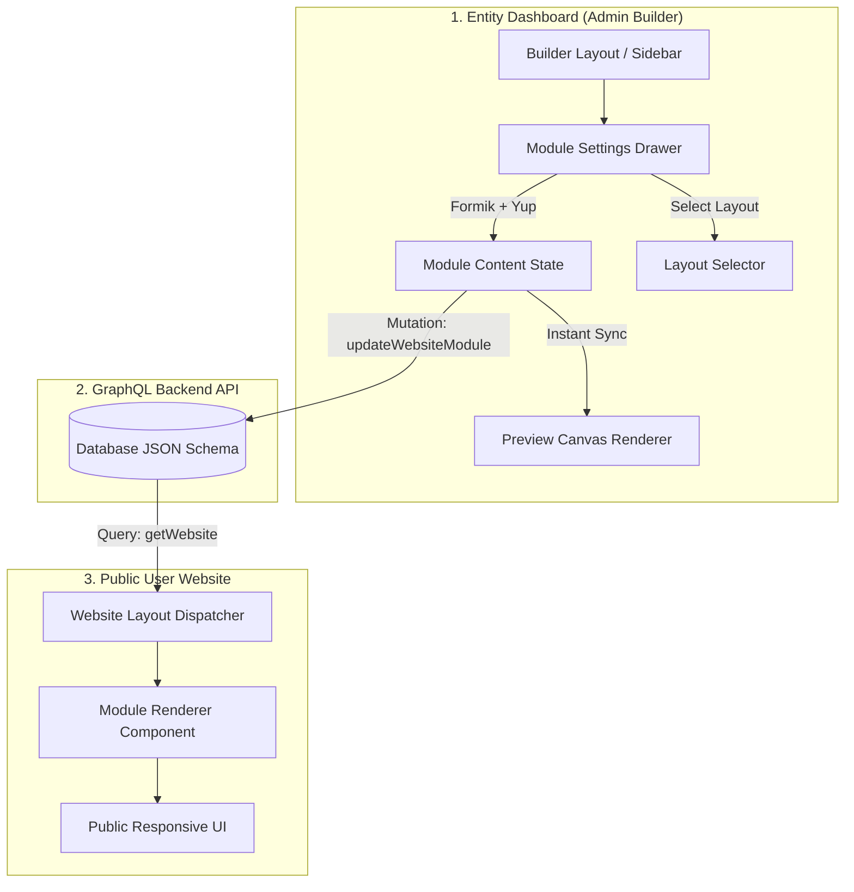

# Thrico Website Builder: Module Architecture & Lifecycle Guide

## 1. Architectural Overview

The **Thrico Website Builder** is a decoupled, modular CMS architecture designed to let community administrators build, customize, and publish rich web pages in real-time. 

Every website page consists of an ordered array of **Modules** (`ModuleData[]`). Each module represents a distinct visual block (e.g., Hero, Pricing, Testimonials, Navbar, Footer) with its own **Content Schema**, **Layout Variants**, and **Formik-powered Settings Drawer**.



---

## 2. Anatomy of a Module

A module in the Thrico ecosystem is defined by four core layers:

```
┌────────────────────────────────────────────────────────┐
│                      MODULE DATA                       │
├─────────────────┬──────────────────────────────────────┤
│ id              │ Unique identifier (e.g., "mod_123")  │
│ type            │ ModuleType (e.g., "hero", "pricing") │
│ layout          │ LayoutType (e.g., "gradient-mesh")   │
│ order           │ Visual sort index on the page        │
│ content         │ Arbitrary typed JSON content payload │
│ isVisible       │ Boolean render flag                  │
└─────────────────┴──────────────────────────────────────┘
```

### Layer 1: Type & Layout Registration
- **Location**: `store/useWebsiteBuilderStore.ts`
- **Definition**:
  ```typescript
  export type ModuleType =
    | "navbar"
    | "hero"
    | "pricing"
    | "testimonials"
    | "feature-highlights"
    | "cta-banner"
    // ...
  
  export type LayoutType =
    | "cards-pricing"
    | "table-pricing"
    | "gradient-tier-matrix"
    | "lifetime-deal-banner"
    // ...
  ```

### Layer 2: Settings Configuration Form (Formik + Yup)
- **Location**: `components/website-layout/settings/<module>-settings.tsx`
- **Purpose**: Rendered inside the slide-over settings drawer when the admin clicks to customize the module.
- **Standards** (Mandatory per `AGENTS.md`):
  1. **Formik & Yup**: Must use `useFormik<FormValues>` with `enableReinitialize: true` and validation via `Yup.object().shape(...)`.
  2. **Polaris / Linear UI**:
     - Grouped Section Cards: `rounded-xl border border-border/70 p-4 bg-card shadow-2xs space-y-4`
     - High-Contrast Step Badges: `<span className="flex h-5 w-5 items-center justify-center rounded-full bg-indigo-600 text-[10px] font-bold text-white">1</span>`
     - Compact Input Fields: `h-9 text-xs` or `h-8 text-xs`
     - Immediate parent sync on change so the live preview updates without requiring an explicit save click.

### Layer 3: Entity Dashboard Preview Renderer
- **Location**: `components/website-layout/preview/<module>-renderer.tsx` or `components/website-layout/modules/<module>-module.tsx`
- **Purpose**: Displays the real-time responsive canvas in the builder viewport (Desktop, Tablet, Mobile). Dynamically switches between the module's layout variants.

### Layer 4: Public User-Website Component (1:1 Sync)
- **Location**: `thrico-user-website/components/website/<module>/`
- **Purpose**: The production component rendered when members visit the public community domain or custom subdomain.
- **Rule**: Must accept the exact same `content` structure and props as the Entity Dashboard renderer.

---

## 3. End-to-End Data & State Flow

### Step 1: Admin Selects or Adds a Module
When an administrator adds a module or selects an existing module in the builder tree:
1. `useWebsiteBuilderStore` selects the active module ID.
2. The right-hand settings drawer opens, dynamically mounting the matching settings component via `components/website-layout/module-settings.tsx`.

### Step 2: Formik Initialization & Real-Time Sync
Inside `<Module>Settings`:
```typescript
const formik = useFormik<ModuleFormValues>({
  enableReinitialize: true,
  initialValues: {
    title: (content?.title as string) || "Default Title",
    plans: (content?.plans as PlanItem[]) || defaultPlans,
    // ...
  },
  validationSchema: moduleValidationSchema,
  onSubmit: (values) => {
    onChange(values);
  },
});

// Immediate sync helper on every input change:
const handleUpdate = (key: string, value: any) => {
  formik.setFieldValue(key, value);
  onChange({
    ...formik.values,
    [key]: value,
  });
};
```
Because `onChange` is triggered immediately, the Zustand store updates `module.content`, immediately re-rendering the live builder canvas.

### Step 3: Layout Switching
1. The admin clicks an alternative layout card in `LayoutSelector`.
2. `onLayoutChange(newLayout)` updates `module.layout` in Zustand.
3. The renderer checks `layout === "newLayout"` and instantly switches the visual component while preserving the underlying content data.

### Step 4: GraphQL Persistence
When the admin clicks **Save** or **Publish**:
1. The builder triggers the GraphQL mutation `useUpdateModule` or `useSaveWebsiteDraft`.
2. The complete `content` object is saved to Postgres as structured JSON.

### Step 5: Public Rendering on `thrico-user-website`
When a visitor visits the website:
1. Next.js fetches the website config via GraphQL `getWebsite`.
2. `components/website/layout.tsx` iterates over `website.modules`.
3. For each module, it delegates to `components/website/<module>/index.tsx`, passing `{ content, layout }`.
4. The dispatcher switches on `layout` and renders the public layout component.

---

## 4. Layout Architecture: Example (Pricing Module)

Here is how the **Pricing & Plans** module is structured across both repositories:

```
thrico-entity-dashboard/
├── components/website-layout/
│   ├── pricing/                          # Modular layout components
│   │   ├── cards-pricing.tsx             # 3-column card stack
│   │   ├── table-pricing.tsx             # Feature comparison matrix
│   │   ├── toggle-pricing.tsx            # Monthly vs annual toggle
│   │   ├── gradient-tier-matrix.tsx      # Dark glowing neon cards
│   │   ├── lifetime-deal-banner.tsx      # Single lifetime pass banner
│   │   ├── minimal-editorial-plans.tsx   # Minimalist monochrome tiers
│   │   └── index.ts                      # Clean barrel export
│   ├── preview/
│   │   └── pricing-renderer.tsx          # Canvas renderer dispatcher
│   └── settings/
│       ├── pricing-settings.tsx          # Formik + Yup Polaris settings form
│       └── layout-selector.tsx           # Layout tiles with icons & descriptions

thrico-user-website/
└── components/website/
    ├── pricing/                          # Public 1:1 identical components
    │   ├── cards-pricing.tsx
    │   ├── table-pricing.tsx
    │   ├── toggle-pricing.tsx
    │   ├── gradient-tier-matrix.tsx
    │   ├── lifetime-deal-banner.tsx
    │   ├── minimal-editorial-plans.tsx
    │   └── index.tsx                     # Public dispatcher & barrel export
    └── layout.tsx                        # Master page layout runner
```

---

## 5. Developer Guide: How to Add a New Module or Layout

Follow this checklist whenever adding a new layout variant or a new module:

### Adding a New Layout to an Existing Module (e.g. `pricing`)

1. **Register the Layout Type**:
   In `thrico-entity-dashboard/store/useWebsiteBuilderStore.ts`, add the new layout string to `LayoutType`.
2. **Expose in Available Layouts**:
   In `thrico-entity-dashboard/components/website-layout/module-settings.tsx`, add the layout string to `getAvailableLayouts(moduleType)`.
3. **Add Tile Metadata**:
   In `thrico-entity-dashboard/components/website-layout/settings/layout-selector.tsx`:
   - Import a Lucide icon.
   - Add icon and short description to `layoutMetadata`.
   - Add human-friendly display name to `layoutDisplayNames`.
4. **Create Dashboard Component**:
   Create `components/website-layout/<module>/<layout-name>.tsx` (smallcase filename).
5. **Wire into Dashboard Renderer**:
   Import into `components/website-layout/preview/<module>-renderer.tsx` and add a `case "<layout-name>":` branch.
6. **Update Settings Controls (if needed)**:
   In `components/website-layout/settings/<module>-settings.tsx`, add Step 3 custom controls specific to this layout.
7. **Create User-Website Component (1:1 Sync)**:
   In `thrico-user-website/components/website/<module>/<layout-name>.tsx`, create the identical component.
8. **Register in User-Website Dispatcher**:
   In `thrico-user-website/components/website/<module>/index.tsx`:
   - Import and add to the `switch (layout)` statement.
   - Export from the barrel.
   - Add to the layouts list in `thrico-user-website/components/website/layout.tsx`.
9. **Verify & Validate**:
   - Run ESLint on all modified dashboard files: `pnpm exec eslint <file>` (Must be 0 errors, 0 warnings).
   - Run TypeScript check on user-website: `npx tsc --noEmit`.

---

## 6. Coding & Styling Standards (Mandatory)

1. **Filenames**: Always use **smallcase / kebab-case** (e.g., `cards-pricing.tsx`, `minimal-editorial-plans.tsx`, `pricing-settings.tsx`). Never use PascalCase or camelCase.
2. **Formik & Yup Requirement**:
   - Never use standalone `useState` hooks for form state.
   - Always define an explicit TypeScript interface for `FormValues`.
   - Always use `useFormik<FormValues>({ enableReinitialize: true, ... })`.
   - Always validate with `Yup.object().shape(...)`.
3. **Type Safety**:
   - Avoid `any`. Type dynamic content objects as `Record<string, unknown>`.
   - Cast fields safely: `(content.title as string) || "Default"`.
4. **Design Aesthetic**:
   - Strictly adhere to semantic Tailwind tokens (`bg-card`, `bg-background`, `border-border/70`, `text-foreground`, `text-muted-foreground`).
   - Support dark mode seamlessly.
   - Use `lucide-react` icons throughout.
